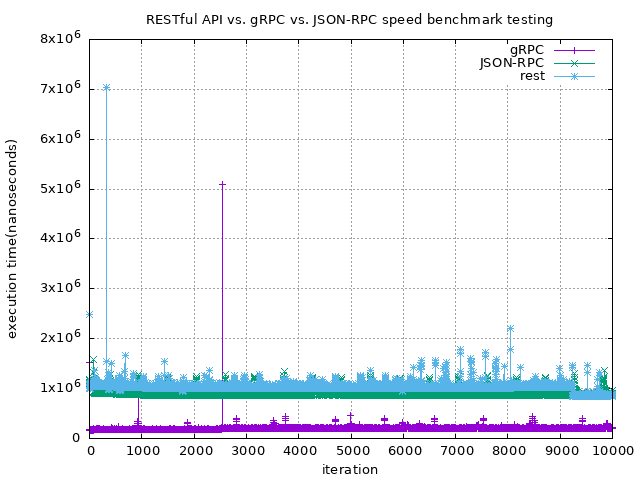

# RESTful-API vs. gRPC benchmark testing
This project contains the benchmark testing code of RESTful-API and gRPC

## Prerequisite
```shell
$ sudo pip3 install -r ./requirements.txt
```

## Benchmark Result


## How to do a benchmark test
There are 2 types of benchmark testing(grpc, rest)\
First, start the server
```shell
$ cd ./grpc or cd ./rest
$ go run server.go
```

Then do a benchmark test
```shell
$ cd ./grpc or cd ./rest
$ python3 benchmark.py
```

## Plot
Once you finished with benchmark testing\
Just simply run
```shell
$ make plot
```

Then you'll get a benchmark result on project root

## License
+ This project is licensed under MIT license, see the [LICENSE](./LICENSE) file for more detail
