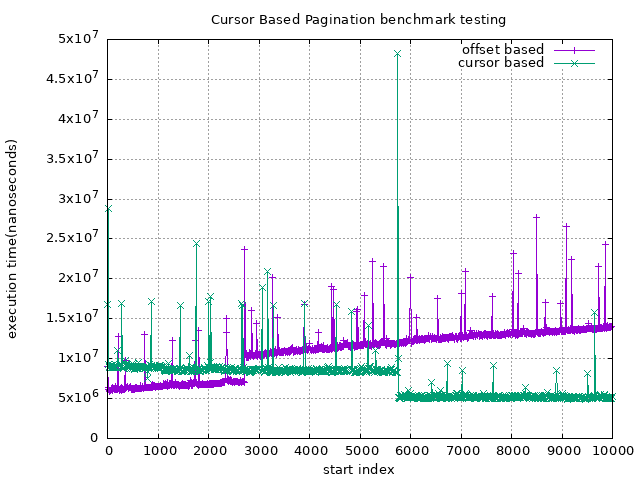
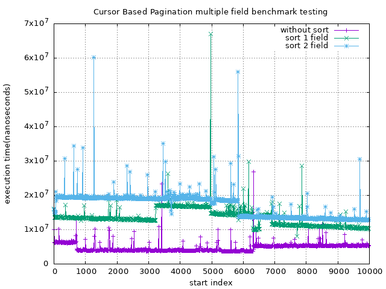

# Cursor Based Pagination
This repo contains the minimal Node.js Backend RESTful API

## Prerequisites
```shell
$ make docker-create
$ make docker-start
```

## Benchmark


```shell
$ make benchmark
$ eog ./benchmark.png
```


```shell
$ make benchmark-sort
$ eog ./benchmark-sort.png
```