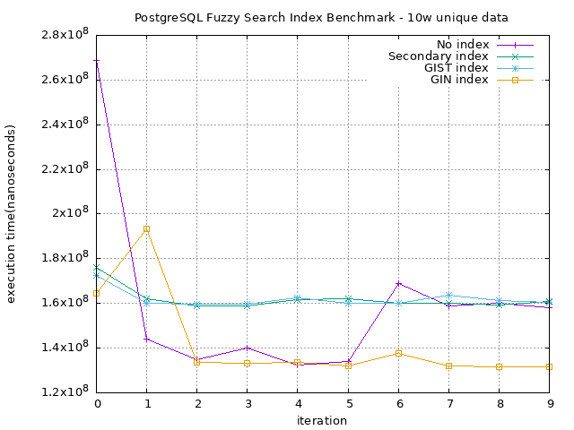
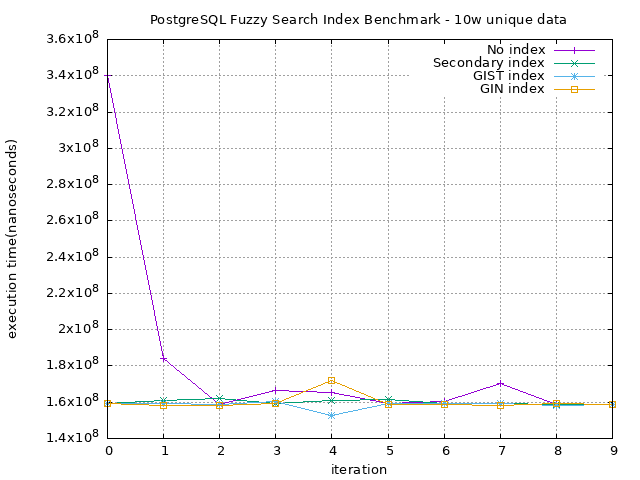

# PostgreSQL GIST vs. GIN Index Benchmark Testing
This project aims to benchmark the difference between GIST and GIN index in postgresql

## Benchmark Result
### 10w rows of unique data



## Run
```shell
$ docker run -d --name gist-gin-benchmark \
    -p 5555:5432 \
    -e POSTGRES_USER=admin \
    -e POSTGRES_PASSWORD=admin \
    -e POSTGRES_DB=benchmark \
    postgres
$ docker cp fakeData/unique.csv gist-gin-benchmark:/
$ npm i
$ npx prisma migrate dev
```

## Benchmark
```shell
$ taskset 0x1 npm run benchmark-unique
$ gnuplot ./unique.gp
```

## License
+ This project is licensed under MIT License, see the [LICENSE](./LICENSE) file for more detail