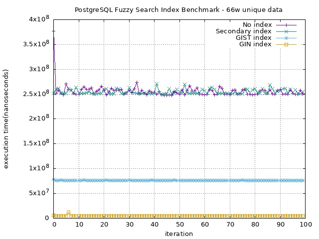
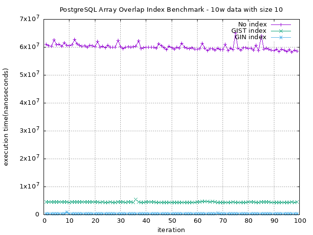

# PostgreSQL GIST vs. GIN Index Benchmark Testing
This project aims to benchmark the difference between GIST and GIN index in postgresql

## Benchmark Result
### 10w Rows of Unique Data


### 66w Rows of Unique Data


### 10w Rows of String Array with Size 10


### 10w Rows of String Array with Size 20


## Run
```shell
$ make init
$ npm i
$ npx prisma migrate dev
```

## Benchmark
```shell
$ make benchmark-unique

$ make benchmark-unique-large
```

## License
+ This project is licensed under MIT License, see the [LICENSE](./LICENSE) file for more detail