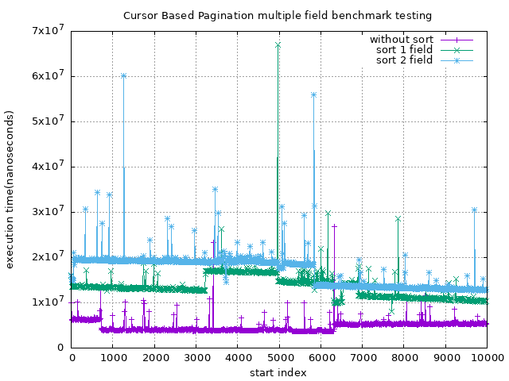

# Simple RESTful Lab
This repo contains the minimal Node.js Backend RESTful API

## Cursor Based Pagination


```shell
$ make benchmark
$ eog ./benchmark.png
```


```shell
$ make benchmark-sort
$ eog ./benchmark-sort.png
```